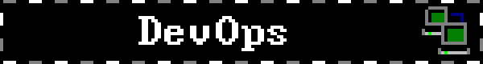

<h1 align="left">Eldar Korovin — DevOps Engineer</h1>

  

  
  
  

  ⚙️ I automate, integrate, deploy and keep infrastructure running. I close the bulk of my team's DevOps work end to end — from CI/CD migration to monitoring and SSO.

### 👨‍💻 About me

- 💼 DevOps Engineer at an enterprise — since July 2025, 10+ servers, three environments (dev/test/prod)
- 🎓 BSc in Computer Science, DevOps track — NArFU, 2021–2025
- 🖥️ Linux (Astra, Debian, Ubuntu), Docker, Ansible, Nginx, Kubernetes (pet projects)
- 🔄 GitLab CI/CD, Nexus Repository, Keycloak SSO
- 🗄️ PostgreSQL, Redis/Valkey, RabbitMQ, MinIO/SeaweedFS
- 📊 ELK/OpenSearch, Grafana Stack (Prometheus, Loki, Tempo, Alertmanager, Alloy)
- 💬 Python and Bash for automation
- 📍 Arkhangelsk, Russia — open to relocation, including abroad · remote, hybrid, on-site
- 🗣️ Russian — native · English — B1

### 🚀 What I've done

- Ran a full **GitLab 12 → 17 migration** off bare metal into Docker — no data loss, cut over in planned night maintenance windows
- Moved CI/CD from **TeamCity + Octopus Deploy to GitLab CI/CD**, unifying build and deploy for .NET, Vue.js and Python
- Built the **ELK / Grafana** logging and monitoring stack for centralised log collection across all services
- Integrated **SSO via Keycloak** for GitLab, Nexus, OpenSearch and other corporate tools
- Set up **Nexus Repository** as the single artifact registry (.NET, npm, apt, PyPI, Docker)
- Deployed object storages on **MinIO and SeaweedFS**

### 📬 Contact

- 🌐 Full resume: [korovin-l.github.io](https://korovin-l.github.io) — available in English and Russian
- 💬 Telegram: [@korovinL](https://t.me/korovinL)
- 📧 Email: korovineldar24@gmail.com

  &nbsp;
  &nbsp;
  &nbsp;
  &nbsp;
  &nbsp;
  &nbsp;
  &nbsp;
  &nbsp;
  &nbsp;
  &nbsp;
  &nbsp;
  &nbsp;
  &nbsp;
  &nbsp;
  &nbsp;

